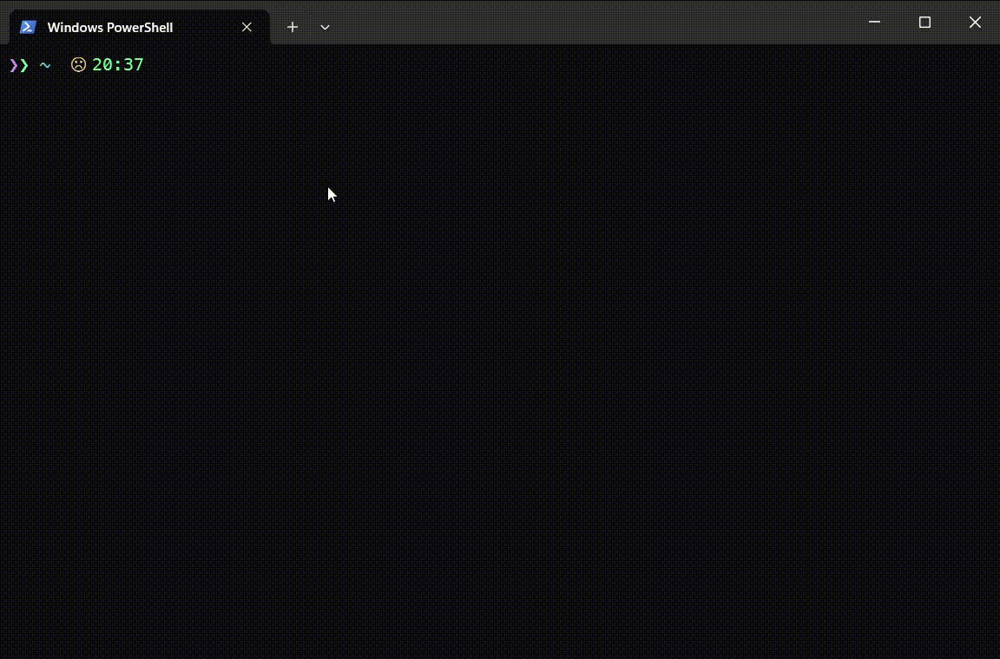

# what-is-word-cli game rounds

> Recorded versions of what-is-word-cli game round

- [Categorized words](#categorized-words)
  * [Fruits words game round](#fruits-words-game-round)
- [From literature](#from-literature)
  * [Words from Ambrose Bierce works](#words-from-ambrose-bierce-works)
    + [Moxon's master words round](#moxons-master-words-round)
    + [Three and one are one words round](#three-and-one-are-one-words-round)

You can play game rounds from [what-is-word-cli](https://github.com/akgondber/what-is-word-cli) without installing npm package but by viewing and solving recorded versions of game rounds.

## Categorized words

### Fruits words game round

[Gif](media/categorized/what-is-word-cli-fruits-round.gif) | [Video](media/categorized/what-is-word-cli-fruits-round.mp4)

  
<strong>Check answers</strong>

[Fruits answers](media/categorized/what-is-word-cli-fruits-round-answers.gif)

[More categorized words game rounds](rounds/categorized/categorized.md)

## From literature

### Words from Ambrose Bierce works

#### Moxon's master words round 

[Imgur post](https://imgur.com/a/nz5kwbK) | [Gif](https://gist.githubusercontent.com/akgondber/736da764f5088121f48c5e5a4190e954/raw/29db052ee03f62331e3e10b770916a1652e6c26b/what-is-word-cli-ab-moxons-master-round.gif) |
[Video](https://gist.github.com/akgondber/62d0e20ae87a3fbd8ddb095bf91f210c/raw/96d6db8e31b624069eeaad7a1344e03e07602c56/what-is-word-cli-ab-moxons-master-round.mp4)

  
<strong>Check answers</strong>

[moxon's master answers](media/literature/ambrose-bierce/answers/what-is-word-cli-moxon-s-master-round-answers.gif)

#### Three and one are one words round 

[imgur post](https://imgur.com/a/5Yx6Z9R) | [Gif](https://gist.githubusercontent.com/akgondber/736da764f5088121f48c5e5a4190e954/raw/29db052ee03f62331e3e10b770916a1652e6c26b/what-is-word-cli-ab-three-and-one-are-one.gif) | [Video](media/literature/ambrose-bierce/what-is-word-cli-ab-three-and-one-are-one.mp4)

  
<strong>Check answers</strong>

[three and one are one answers](media/literature/ambrose-bierce/answers/what-is-word-cli-three-and-one-are-one-answers.mp4)

[More rounds from Ambrose Bierce works](rounds/literature/ambrose-bierce.md)

[what-is-word-cli](https://github.com/akgondber/what-is-word-cli) - CLI game where your task is to unscramble words by given definition
